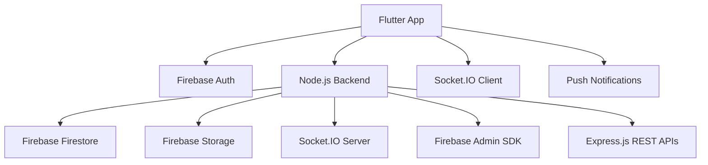

# 🎓 Lendly - Campus Sharing Made Simple
## 🏆 Microsoft Imagine Cup 2026 Submission

<div align="center">


**📚 Lend • 🤝 Borrow • 💰 Sell • 🌱 Share • 💬 Connect**

*Empowering college students to share resources, save money, and build meaningful connections within their campus community through an intelligent peer-to-peer lending platform.*

[](https://flutter.dev)
[](https://dart.dev)
[](https://firebase.google.com)
[](https://socket.io/)
[](https://nodejs.org/)


</div>

---

## 🌟 Why Choose Lendly?

> **"Why buy when you can borrow? Why study alone when you can learn together?"**

Lendly revolutionizes how college students share resources through an intelligent, trust-based ecosystem. From textbooks to tech gadgets, sports equipment to study materials - connect with your campus community and transform the way students help each other succeed! 🚀

### 🎯 Core Benefits
- 💰 **Save Money** - Borrow instead of buying expensive items (Save up to ₹50,000/year)
- 🌍 **Reduce Waste** - Give unused items a second life through sustainable sharing
- 🤝 **Build Connections** - Meet like-minded students and form lasting friendships
- 🛡️ **Stay Safe** - Verified student-only community with trust scoring
- ⭐ **Earn Trust** - Build your campus reputation through positive interactions
- 🏆 **Get Rewarded** - Earn points, badges, and achievements for active participation
- 💬 **Chat Seamlessly** - Real-time messaging with typing indicators and reactions

---

## ✨ Features Overview

### 🔐 **Student Verification System**
- College email verification
- Student ID upload and verification
- Admin approval process for guaranteed authenticity

---

## ✨ Advanced Features Overview

### 🔐 **Smart Student Verification System**
- **Email Verification** - College email authentication with domain validation
- **Document Upload** - Student ID and enrollment verification
- **Admin Approval** - Manual review process for guaranteed authenticity
- **Multi-College Support** - Supports universities across different regions

### 📱 **Intelligent Item Management**
```
📚 Books & Study Materials    🖥️ Electronics & Gadgets      🎮 Gaming Accessories
⚽ Sports Equipment          🔧 Tools & Utilities          🎵 Musical Instruments
👕 Fashion & Accessories     🏠 Dorm Room Essentials        🚲 Transportation
📷 Photography Equipment     🍳 Kitchen Appliances         📐 Academic Supplies
```

### 💬 **Advanced Real-time Communication**
- **Instant Messaging** - Lightning-fast chat with delivery confirmations
- **Group Messaging** - Create study groups and community chats
- **Typing Indicators** - See when others are typing in real-time
- **Message Reactions** - React with emojis to messages
- **Message Editing** - Edit sent messages within time limits
- **File Sharing** - Share documents, images, and other files
- **Push Notifications** - Never miss important messages or updates
- **Chat History** - Persistent message history across devices
- **Message Status** - Delivered, read, and typing status indicators

### 👥 **Enhanced Community Features**
- **College Groups** - Join your institution's community automatically
- **Interest-based Groups** - Create and join hobby/study groups
- **Friend Network** - Send friend requests and build connections
- **Trust Score System** - Advanced reliability scoring based on interactions
- **User Profiles** - Detailed profiles with ratings and achievements
- **Event Creation** - Organize campus events and meetups
- **Study Circles** - Form academic collaboration groups

### 💳 **Comprehensive Digital Wallet**
- **In-app Transactions** - Secure payment processing with multiple methods
- **Digital Rewards** - Point-based reward system for active users
- **Achievement System** - Unlock badges for different milestones
- **Leaderboards** - Campus-wide and group-specific ranking systems
- **Transaction History** - Detailed financial tracking and analytics
- **Escrow Services** - Secure holding of funds until transaction completion
- **Automatic Refunds** - Smart refund processing for failed transactions

### 🛡️ **Advanced Safety & Trust Features**
- **Identity Verification** - Multi-step verification process
- **Trust Algorithms** - AI-powered user reliability assessment
- **Dispute Resolution** - Built-in mediation system for conflicts
- **Report System** - Comprehensive reporting for inappropriate behavior
- **Block & Restrict** - Advanced user management controls
- **Safe Meeting Points** - Campus-approved meeting location suggestions
- **Emergency Contacts** - Quick access to campus security
- **Transaction Insurance** - Protection against fraud and disputes

### 📊 **Smart Analytics & Insights**
- **Personal Dashboard** - Track your lending/borrowing activities
- **Spending Analytics** - Monitor your savings and expenses
- **Trust Score Analytics** - Understand your community reputation
- **Item Performance** - See how well your listings perform
- **Campus Trends** - Discover what's popular in your college
- **Environmental Impact** - Track your contribution to sustainability

---

---

## 📱 App Screenshots & Demo

<div align="center">

| Authentication Flow | Main Dashboard | Item Discovery |
|---------------------|----------------|----------------|
|  |  |  |

| Real-time Chat | Group Management | Rewards System |
|----------------|------------------|----------------|
|  |  |  |

*Clean, intuitive interface designed specifically for college students with modern Material Design principles*

</div>

### 🎥 **Live Demo & Video Walkthrough**
- **📱 Interactive Demo**: [Try Lendly Web App](https://lendly-demo.vercel.app)
- **🎬 YouTube Demo**: [Watch Full Walkthrough](https://youtube.com/watch?v=demo-link)
- **📋 Pitch Deck**: [View Presentation](https://pitch-deck-link.pdf)
- **🏆 Imagine Cup Submission**: [Microsoft Submission Portal](https://imaginecup.microsoft.com/submissions)

---

---

## 🚀 Getting Started

### 📋 Prerequisites & System Requirements
- **Flutter SDK**: 3.0 or higher
- **Dart SDK**: 2.17 or higher
- **IDE**: Android Studio, VS Code, or IntelliJ IDEA
- **Git**: Latest version
- **Node.js**: 16.x or higher (for backend development)
- **Firebase Account**: For database and authentication
- **Android Studio**: For Android development
- **Xcode**: For iOS development (macOS only)

### 🛠️ Development Environment Setup

#### **1. Clone the Repository**
```bash
# Clone the main repository
git clone https://github.com/Arya182-ui/Lendly.git
cd Lendly

# Navigate to the Flutter application
cd Application
```

#### **2. Install Flutter Dependencies**
```bash
# Install all Flutter packages
flutter pub get

# Verify Flutter installation
flutter doctor

# Run code generation (if needed)
flutter packages pub run build_runner build
```

#### **3. Firebase Configuration**
```bash
# Install Firebase CLI
npm install -g firebase-tools

# Login to Firebase
firebase login

# Initialize Firebase project
firebase init

# Add Firebase configuration files
# - Download google-services.json for Android
# - Download GoogleService-Info.plist for iOS
```

#### **4. Environment Configuration**
```bash
# Create environment configuration
cp .env.example .env

# Edit configuration with your values
nano .env
```

### ⚡ Quick Start Commands

#### **Development Mode**
```bash
# Run on Android emulator/device
flutter run --debug

# Run on iOS simulator/device (macOS only)
flutter run --debug -d ios

# Run on web browser
flutter run --debug -d chrome

# Run with hot reload enabled (default in debug mode)
flutter run --hot
```

#### **Testing & Quality Assurance**
```bash
# Run all unit tests
flutter test

# Run integration tests
flutter test integration_test/

# Check code quality
flutter analyze

# Format code
flutter format lib/

# Check for outdated dependencies
flutter pub outdated
```

### 🔧 Production Build & Deployment

#### **Android APK/AAB Build**
```bash
# Build APK for distribution
flutter build apk --release

# Build Android App Bundle (recommended for Google Play)
flutter build appbundle --release

# Build APK for specific architecture
flutter build apk --target-platform android-arm64 --release
```

#### **iOS App Store Build**
```bash
# Build for iOS App Store (macOS only)
flutter build ios --release

# Build IPA file for distribution
flutter build ipa --release
```

#### **Web Deployment**
```bash
# Build for web deployment
flutter build web --release

# Deploy to Firebase Hosting
firebase deploy --only hosting

# Deploy to other platforms
# The build files will be in build/web/
```

#### **Desktop Applications** 
```bash
# Build for Windows (Windows only)
flutter build windows --release

# Build for macOS (macOS only)
flutter build macos --release

# Build for Linux (Linux only)
flutter build linux --release
```

---

## 🎮 Complete User Guide

### 🌟 **Getting Started (First-time Users)**

#### **1️⃣ Account Creation & Verification**
1. **Download & Install**: Get Lendly from your preferred app store
2. **Sign Up**: Use your college email address (@yourcollegename.edu)
3. **Email Verification**: Click the verification link sent to your email
4. **Document Upload**: Upload clear photos of your student ID
5. **Profile Setup**: Add profile picture, bio, and interests
6. **Approval Wait**: Admin approval usually takes 24-48 hours
7. **Welcome Tour**: Complete the in-app tutorial

#### **2️⃣ Profile Completion & Optimization**
1. **Personal Info**: Add name, year of study, and major
2. **College Details**: Select your institution and campus
3. **Interests**: Choose from 50+ categories (sports, academics, hobbies)
4. **Contact Preferences**: Set notification and communication preferences
5. **Privacy Settings**: Configure what others can see about you
6. **Verification Badge**: Display your verified student status

### 💬 **Mastering the Chat System**

#### **Individual Messaging**
- **Start Conversations**: Tap the message icon on any user profile
- **Rich Messages**: Send text, emojis, images, and documents
- **Message Reactions**: Long-press messages to add emoji reactions
- **Edit Messages**: Tap and hold sent messages to edit (within 5 minutes)
- **Delete Messages**: Remove messages for yourself or everyone
- **Voice Messages**: Hold the mic button to record voice notes
- **File Sharing**: Attach documents, images, and other files up to 25MB

#### **Group Chat Features**
- **Create Groups**: Start new groups for study circles or interests
- **Group Management**: Add/remove members, assign admins
- **Group Settings**: Customize group name, description, and avatar
- **Announcements**: Pin important messages for all members
- **Member Roles**: Admin, moderator, and member permissions
- **Group Discovery**: Find and join public college groups

#### **Real-time Features**
- **Typing Indicators**: See when others are typing
- **Online Status**: Check who's currently active
- **Message Status**: Sent ✓, Delivered ✓✓, Read ✓✓
- **Push Notifications**: Get notified of new messages instantly
- **Do Not Disturb**: Mute notifications for specific chats or time periods

### 📚 **Item Management Mastery**

#### **Listing Items for Lending/Selling**
1. **Add New Item**: Tap the "+" button on home screen
2. **Item Details**: Enter title, description, and category
3. **Upload Photos**: Add up to 10 high-quality images
4. **Set Pricing**: Configure lending/selling prices
5. **Availability**: Set available dates and pickup locations
6. **Condition**: Accurately describe item condition
7. **Terms & Conditions**: Add specific lending terms
8. **Publish**: Review and publish your listing

#### **Finding & Requesting Items**
1. **Browse Feed**: Scroll through available items on home screen
2. **Smart Search**: Use filters (category, price, distance, availability)
3. **Item Details**: View photos, descriptions, and owner ratings
4. **Send Request**: Tap "Request to Borrow" or "Buy Now"
5. **Chat with Owner**: Discuss details through built-in messaging
6. **Arrange Meetup**: Coordinate pickup/delivery through the app
7. **Complete Transaction**: Confirm receipt and rate the experience

### 👥 **Building Your Network**

#### **Friend Management**
- **Send Requests**: Tap "Add Friend" on user profiles
- **Mutual Friends**: See friends you have in common
- **Friend Recommendations**: Discover suggested connections
- **Block Users**: Remove unwanted contacts
- **Privacy Controls**: Manage who can send you friend requests

#### **Group Participation**
- **Join Groups**: Search and join college/interest-based groups
- **Create Groups**: Start new communities around your interests
- **Group Roles**: Participate as member, moderator, or admin
- **Event Planning**: Organize study sessions and social events
- **Group Chat**: Engage in community discussions

### 🏆 **Rewards & Achievements System**

#### **Earning Points & Badges**
- **Daily Login**: 5 points for opening the app
- **Complete Profile**: 50 points for 100% profile completion
- **First Lend**: 100 points for your first lending transaction
- **Helpful Reviews**: 10 points per helpful review received
- **Group Participation**: 25 points for joining groups
- **Friend Referrals**: 150 points per successful referral
- **Community Helper**: 200 points for achieving high trust score

#### **Achievement Categories**
- 🎓 **Academic**: Study-related achievements and collaborations
- 🤝 **Social**: Friendship and community building milestones
- 💰 **Financial**: Savings and smart spending achievements
- 🌱 **Sustainability**: Environmental impact contributions
- ⭐ **Trust**: Reliability and trustworthiness milestones
- 🏆 **Special**: Seasonal and limited-time achievements

#### **Leaderboards & Competition**
- **Campus Rankings**: See top contributors in your college
- **Group Leaderboards**: Compete within your groups
- **Monthly Challenges**: Participate in themed competitions
- **Seasonal Events**: Special events with exclusive rewards

---

---

## 🏗️ Technical Architecture & Project Structure

### **📁 Detailed Directory Structure**
```
Lendly/
├── 📱 Application/                    # Flutter Frontend
│   ├── 🎨 lib/
│   │   ├── 🖥️ screens/              # UI Screens & Pages
│   │   │   ├── auth/                 # Authentication screens
│   │   │   ├── home/                 # Home dashboard
│   │   │   ├── chat/                 # Enhanced messaging system
│   │   │   ├── groups/               # Group management
│   │   │   ├── profile/              # User profiles
│   │   │   ├── items/                # Item management
│   │   │   ├── wallet/               # Digital wallet
│   │   │   └── rewards/              # Rewards & achievements
│   │   ├── 🔧 services/              # Business Logic Layer
│   │   │   ├── enhanced_chat_service.dart        # Real-time messaging
│   │   │   ├── enhanced_notification_service.dart # Push notifications
│   │   │   ├── friendship_service.dart           # Friend management
│   │   │   ├── group_service.dart               # Group operations
│   │   │   ├── reward_service.dart              # Gamification
│   │   │   ├── socket_service.dart              # WebSocket connections
│   │   │   └── firebase_auth_service.dart       # Authentication
│   │   ├── 📊 providers/             # State Management (Provider Pattern)
│   │   │   ├── auth_provider.dart
│   │   │   ├── chat_provider.dart
│   │   │   ├── user_provider.dart
│   │   │   └── theme_provider.dart
│   │   ├── 🧩 widgets/               # Reusable UI Components
│   │   │   ├── common/               # Shared widgets
│   │   │   ├── chat/                 # Chat-specific widgets
│   │   │   ├── items/                # Item-related widgets
│   │   │   └── forms/                # Form components
│   │   ├── 🎯 models/                # Data Models & DTOs
│   │   │   ├── user_model.dart
│   │   │   ├── chat_message.dart
│   │   │   ├── group_model.dart
│   │   │   └── item_model.dart
│   │   ├── 🔧 utils/                 # Utility Functions
│   │   │   ├── constants.dart
│   │   │   ├── validators.dart
│   │   │   └── helpers.dart
│   │   ├── 🎨 theme/                 # App Theming
│   │   │   ├── colors.dart
│   │   │   ├── text_styles.dart
│   │   │   └── app_theme.dart
│   │   └── 🌐 config/                # Configuration Files
│   │       ├── app_config.dart
│   │       └── api_endpoints.dart
│   ├── 🎨 assets/                    # Static Assets
│   │   ├── images/                   # App images & illustrations
│   │   ├── icons/                    # Custom icons
│   │   └── fonts/                    # Custom fonts
│   ├── 🤖 android/                   # Android-specific files
│   │   ├── app/src/main/             # Android app configuration
│   │   └── gradle/                   # Gradle build scripts
│   ├── 🍎 ios/                       # iOS-specific files
│   │   ├── Runner/                   # iOS app configuration
│   │   └── Runner.xcodeproj/         # Xcode project files
│   ├── 🌐 web/                       # Web-specific files
│   ├── 🪟 windows/                   # Windows desktop files
│   ├── 🐧 linux/                     # Linux desktop files
│   ├── 🍏 macos/                     # macOS desktop files
│   └── 🧪 test/                      # Unit & Widget Tests
├── 🖥️ Backend/                       # Node.js Backend API
│   ├── 🛣️ routes/                   # API Route Handlers
│   │   ├── auth.js                   # Authentication endpoints
│   │   ├── chat.js                   # Enhanced messaging APIs
│   │   ├── friends.js                # Friendship management
│   │   ├── groups.js                 # Group operations
│   │   ├── user.js                   # User & notification management
│   │   ├── items.js                  # Item CRUD operations
│   │   ├── transactions.js           # Transaction processing
│   │   └── wallet.js                 # Digital wallet APIs
│   ├── 🛡️ middleware/               # Express Middleware
│   │   ├── auth.js                   # Authentication & rate limiting
│   │   ├── errorHandler.js           # Error handling
│   │   └── validation.js             # Input validation
│   ├── 🔧 utils/                     # Backend Utilities
│   │   ├── firestore-helpers.js      # Database helpers
│   │   ├── validators.js             # Data validation
│   │   ├── cache-manager.js          # Caching layer
│   │   └── logger.js                 # Logging system
│   ├── ✅ validation/                # Input Validation Schemas
│   │   ├── auth.schemas.js           # Auth validation rules
│   │   ├── groups.schemas.js         # Group validation
│   │   └── items.schemas.js          # Item validation
│   ├── 📋 config.js                  # Server configuration
│   ├── 🚀 index.js                   # Express server & Socket.IO
│   └── 📦 package.json               # Node.js dependencies
└── 📚 Documentation/                 # Project Documentation
    ├── API_DOCUMENTATION.md          # Complete API reference
    ├── USER_MANUAL.md                # End-user guide
    ├── DEPLOYMENT_GUIDE.md           # Deployment instructions
    └── ARCHITECTURE.md               # System architecture
```

### **🔗 Service Dependencies & Integrations**


---

---

## 🛠️ Comprehensive Tech Stack

<div align="center">

| **Category** | **Technology** | **Purpose** | **Version** |
|--------------|----------------|-------------|-------------|
| **Frontend Framework** | Flutter & Dart | Cross-platform mobile/web development | 3.0+ |
| **State Management** | Provider Pattern | Reactive state management across app | 6.1.5+ |
| **Backend Framework** | Node.js & Express.js | RESTful API server and middleware | 4.18+ |
| **Real-time Communication** | Socket.IO | Instant messaging & live features | 4.8+ |
| **Database** | Firebase Firestore | NoSQL real-time database | Latest |
| **Authentication** | Firebase Auth | User authentication & verification | 5.3+ |
| **File Storage** | Firebase Storage | Image & document storage | Latest |
| **Push Notifications** | Firebase Cloud Messaging | Cross-platform notifications | Latest |
| **Caching** | Redis & In-Memory | High-performance caching layer | Latest |
| **Input Validation** | Joi & Dart Validators | Server & client-side validation | 18.0+ |
| **UI Framework** | Material Design 3 | Modern, accessible interface design | Latest |
| **Maps & Location** | Google Maps API | Location-based item discovery | Latest |
| **Image Processing** | Firebase ML & Dart | Image recognition & optimization | Latest |
| **Analytics** | Firebase Analytics | User behavior & app performance | Latest |
| **Crash Reporting** | Firebase Crashlytics | Real-time error monitoring | Latest |
| **Testing** | Flutter Test & Jest | Comprehensive testing framework | Latest |
| **CI/CD** | GitHub Actions | Automated testing & deployment | Latest |
| **Security** | Firebase Security Rules | Data protection & access control | Latest |

</div>

### **🎨 Design System & UI Philosophy**

#### **Color Palette & Branding**
```css
/* Primary Brand Colors */
🎨 Primary Green: #1DBF73      /* Trust, Growth, Success */
🎨 Deep Blue: #1a237e          /* Reliability, Professionalism */  
🎨 Accent Orange: #FF6B35      /* Energy, Call-to-Action */
🎨 Success Green: #4CAF50      /* Positive Actions, Confirmations */

/* Neutral & Background Colors */
🎨 Pure White: #FFFFFF         /* Clean Background */
🎨 Light Grey: #F8FAFB         /* Subtle Backgrounds */
🎨 Medium Grey: #6C757D        /* Secondary Text */
🎨 Dark Grey: #343A40          /* Primary Text */

/* Status & Notification Colors */
🎨 Warning Yellow: #FFC107     /* Caution, Attention */
🎨 Error Red: #DC3545          /* Errors, Critical Actions */
🎨 Info Blue: #17A2B8          /* Information, Links */
🎨 Light Success: #E8F9F1      /* Success Backgrounds */
```

#### **Typography Hierarchy**
- **Headlines**: Roboto Bold, 24-32px
- **Subheadings**: Roboto Medium, 18-24px
- **Body Text**: Roboto Regular, 14-16px
- **Captions**: Roboto Light, 12-14px
- **Buttons**: Roboto Medium, 14-16px

#### **Component Design Principles**
- **Consistent Spacing**: 8px grid system
- **Rounded Corners**: 8px border radius for cards, 24px for buttons
- **Elevation**: Material Design shadow levels
- **Animations**: Smooth 300ms transitions
- **Accessibility**: WCAG 2.1 AA compliance

---

## 🎯 Use Cases

<div align="center">

| Scenario | Solution | Benefit |
|----------|----------|---------|
| **Expensive Textbook** | Borrow from senior student | Save ₹2000+ per semester |
| **Scientific Calculator** | Lend to junior after exams | Earn trust points + money |
| **Sports Equipment** | Share badminton racket | Make new friends |
| **Study Group** | Join/create subject groups | Better grades together |

</div>

---

## 🔒 Safety & Trust Features

- ✅ **Student Verification** - Only verified college students
- ⭐ **Trust Score System** - Rate and review users
- 🛡️ **Safe Chat** - Moderated messaging system
- 📍 **Location Sharing** - Optional for item pickup
- 🚨 **Report System** - Report inappropriate behavior

---

## 📱 Platform Support

- ✅ **Android** (5.0+) - Fully supported
- ✅ **iOS** (11.0+) - Fully supported
- ✅ **Web** (Chrome, Firefox, Safari) - Responsive design
- ⏳ **Desktop** (Windows, macOS, Linux) - Coming soon

---

## 🤝 Contributing

We welcome contributions from the community! Here's how you can help:

### 🐛 **Bug Reports**
Found a bug? Please create an issue with:
- Clear description of the problem
- Steps to reproduce
- Expected vs actual behavior
- Screenshots (if applicable)

### 💡 **Feature Requests**
Have an idea? We'd love to hear it!
- Explain the feature in detail
- Describe the problem it solves
- Provide mockups if possible

### 🔧 **Development**
1. Fork the repository
2. Create a feature branch (`git checkout -b feature/AmazingFeature`)
3. Commit your changes (`git commit -m 'Add some AmazingFeature'`)
4. Push to the branch (`git push origin feature/AmazingFeature`)
5. Open a Pull Request

---

## 🎓 For Educational Institutions

Lendly can be customized for your college:
- Custom branding and colors
- Institution-specific features
- Admin dashboard for monitoring
- Analytics and reporting

Interested? Reach out to discuss implementation!

---

## � Releases & Downloads

### 🚀 **Latest Release - v1.0.0** *(January 2026)*

<div align="center">

[](https://github.com/Arya182-ui/Lendly/releases/latest)
[](https://github.com/Arya182-ui/Lendly/releases/latest)
[](https://github.com/Arya182-ui/Lendly/releases/latest)

</div>

### ✨ **What's New in v1.0.0**
- 🎓 **Student Verification System** - Complete college email and ID verification
- 💬 **Real-time Messaging** - Chat with other students instantly
- 👥 **Group Communities** - Join and create college-specific groups
- 💳 **Digital Wallet** - Manage transactions and rewards
- 📱 **Cross-platform Support** - Android, iOS, and Web
- 🛡️ **Trust & Safety** - Comprehensive rating and reporting system
- 🌍 **Location-based Discovery** - Find items near your campus
- 📊 **User Dashboard** - Track your lending/borrowing activities

### 📱 **Download Options**

| Platform | Download | Requirements | Size |
|----------|----------|-------------|------|
| **Android** | [APK Download](https://github.com/Arya182-ui/Lendly/releases/latest) | Android 5.0+ | ~15 MB |
| **iOS** | [App Store*](https://github.com/Arya182-ui/Lendly/releases/latest) | iOS 11.0+ | ~20 MB |
| **Web** | [Progressive Web App](https://github.com/Arya182-ui/Lendly/releases/latest) | Modern Browser | N/A |
| **Windows** | Coming Soon | Windows 10+ | ~25 MB |
| **macOS** | Coming Soon | macOS 10.14+ | ~22 MB |
| **Linux** | Coming Soon | Ubuntu 18.04+ | ~23 MB |

*iOS release pending App Store approval

### 🔄 **Release History**

<details>
<summary><strong>📋 View All Releases</strong></summary>

#### **v1.0.0-beta.3** *(December 2025)*
- 🐛 Fixed group chat message persistence
- ⚡ Improved app startup performance  
- 🎨 Enhanced UI loading states
- 🔒 Better error handling for authentication

#### **v1.0.0-beta.2** *(November 2025)*
- 💬 Added group messaging functionality
- 🔍 Improved search and filtering
- 📱 Mobile responsiveness enhancements
- 🛠️ Bug fixes and performance optimizations

#### **v1.0.0-beta.1** *(October 2025)*
- 🎯 Initial beta release
- 👤 User profiles and verification
- 📚 Basic item lending/borrowing
- 🏠 Home screen with item discovery

#### **v1.0.0-alpha** *(September 2025)*
- 🌱 First alpha version
- 🔐 Authentication system
- 📝 Basic app structure
- 🎨 UI/UX foundation

</details>

### 🚧 **Development Roadmap**

#### **v1.1.0** *(Coming March 2026)*
- 🔔 Push notifications
- 📊 Advanced analytics dashboard
- 🏆 Gamification with badges and leaderboards
- 🌐 Multi-college support

#### **v1.2.0** *(Coming June 2026)*
- 💰 Enhanced payment integration
- 🤖 AI-powered item recommendations
- 📸 Advanced image recognition
- 🌍 Expanded location services

#### **v2.0.0** *(Coming December 2026)*
- 🏢 Enterprise features for institutions
- 📈 Advanced reporting and insights
- 🔄 Marketplace integration
- 🌟 Premium features

---

## �📞 Support & Feedback

- 💬 **General Questions** - Create a GitHub issue
- 🐛 **Bug Reports** - Use our issue template
- 💡 **Feature Requests** - Start a discussion

---

## 📄 License

This project is licensed under the MIT License - see the [LICENSE](LICENSE) file for details.

---

## 🙏 Acknowledgments

Special thanks to:
- All college students who provided valuable feedback during development
- Flutter community for comprehensive documentation and resources
- Open source contributors who made this project possible
- Educational institutions supporting innovative student solutions

---

<div align="center">

**🚀 Ready to revolutionize campus sharing?**

[📱 Download Now](https://github.com/Arya182-ui/Lendly/releases) • [🐛 Report Bug](https://github.com/Arya182-ui/Lendly/issues) • [💡 Request Feature](https://github.com/Arya182-ui/Lendly/issues)

---

## 📈 Project Stats


---

**Made with ❤️ for students, by students**

*Transforming campus communities one share at a time* ✨

⭐ **If this project helped you, please star the repository!**

</div>
